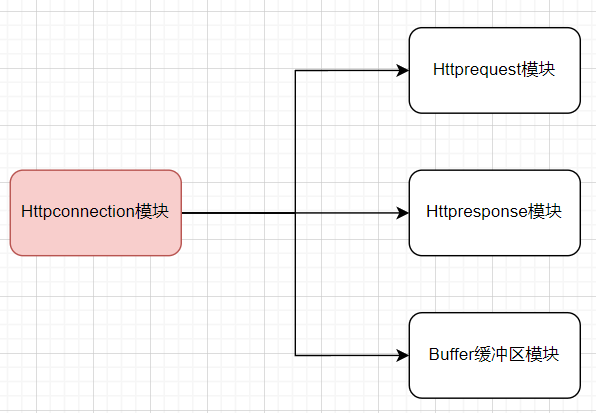

## HTTP连接处理详解

### 背景

服务器和核心功能是完成对HTTP请求报文的解析，并向客户端发出HTTP响应报文。在Httpconnection模块正是要完成上述的功能需求。

为了完成报文解析、资源定位、发送响应等功能需求，该项目一共是写了4个头文件，与此对应的就是4个模块：Httpconnection模块、Httprequest模块、Httpresponse模块以及Buffer缓冲区模块。四个模块之间的相互关系如下图所示



### Httpconnection类成员变量介绍

Httpconnection是对HTTP连接的抽象，在模块中要定义一些变量保存socket通信客户端的信息：（建立socket连接由其他模块负责，这里只负责通信和关闭通信）一条socket连接就需要一个Httpconnection模块，所以我们使用`m_fd`唯一的标记它；并且使用`m_isClose`判断连接是否被关闭，便于调用`closeConn`关闭客户端连接。一个HTTP连接还需要读写数据，所以给每一个HTTP连接定义一个读缓冲区和一个写缓冲区。在解析请求和响应请求的时候，我们借助`Httprequest和Httpresponse`完成，所以也需要各种定义一个这两种变量。
```cpp
private:
    int m_fd;
    struct sockaddr_in m_addr; // 获取IP和port
    bool isClose;

    int m_iovCnt;
    struct iovec m_iov[2]; // 用于分散写writev的结构体

    Buffer m_readBuf;
    Buffer m_writeBuf;

    Httprequest m_request;
    Httpresponse m_response;
```
此外，还定义了三个static静态成员：`isET`, `srcDir`, `userCount`。类的静态成员不属于某一个类对象，是属于整个类的，所有的类对象都可以访问该静态成员。
`isET`布尔变量表征所有的Httpconnection对象是否在使用epoll的ET边缘触发模式。
`srcDir`定位资源的根路径
`userCount`是当前连接的数量。由于对该变量有多线程读取和写入，需要作线程保护。我们可以使用std::atomic对变量进行线程保护
```cpp
public:
    static bool isET;
    static const char *srcDir;
    static std::atomic<int> userCount;
```
### Httpconnection任务流程介绍

成员变量的介绍到这里就结束了。下面对Httpconnection模块的执行流程作一个介绍：

完成工作任务的主要是3个函数：
```cpp
    ssize_t readBuffer(int *saveErrno);
    bool handleHTTPConn();
    ssize_t writeBuffer(int *saveErrno);
```
`readBuffer`函数从m_fd对应的socket中读取数据，由于在Buffer缓冲区中我们已经定义好了读取函数`recvFd`，这里只是简单的对该函数进行封装即可。读取到的HTTP请求报文会保存在之前定义的读取缓冲`m_readBuf`

`handlerHTTPConn`整个类执行任务的核心。在该函数中，我们将`m_readBuf`交由请求解析模块m_request进行报文解析，成功解析后，会调用报文响应模块m_response完成响应报文状态行和首部字段的填写、分散写结构体m_iov的装填等一系列操作。函数执行成功后，将会返回1。

`writeBuffer`函数是将数据发送到m_fd对应的socket中去。由于需要发送服务器上的文件资源，针对这种情况通常都是使用`writev`分散写函数将多块内存的数据一同发送到socket对端。当`handlerHTTPConn`函数执行成功后，m_iov结构体已经填充好了要发送的响应报文（状态行、首部字段、报文主体），此时调用`writeBuffer`函数就可以将响应报文发送给客户端。


以上便是Httpconnection模块的工作流程。当然，在执行任务之前，需要调用`initHTTPConn`函数对成员变量进行初始化。此外，还定义了一些外部接口函数，以供访问内部的成员变量。

Httpconnection类的实现：
```cpp
#ifndef __HTTPCONNECT_H__
#define __HTTPCONNECT_H__
#include <arpa/inet.h> //sockaddr_in
#include <sys/uio.h>   //readv/writev
#include <iostream>
#include <sys/types.h>
#include <assert.h>
#include <atomic>
#include "httprequest.h"
#include "httpresponse.h"
#include "bufferV2.h"
class Httpconnection
{
public:
    Httpconnection();
    ~Httpconnection();
    void initHTTPConn(int socketFd, const sockaddr_in &addr);
    //每个连接中定义的对缓冲区的读写接口
    ssize_t readBuffer(int *saveErrno);
    ssize_t writeBuffer(int *saveErrno);
    //关闭HTTP连接的接口
    void closeHTTPConn();
    //定义处理该HTTP连接的接口，主要分为request的解析和response的生成
    bool handleHTTPConn();
    //其他方法
    const char *getIP() const;
    int getPort() const;
    int getFd() const;
    sockaddr_in getAddr() const;
    int writeBytes();
    bool isKeepAlive() const;

    static bool isET;
    static const char *srcDir;
    static std::atomic<int> userCount;
private:
    int m_fd;
    struct sockaddr_in m_addr;
    bool isClose;
    int m_iovCnt;
    struct iovec m_iov[2]; // 用于分散写writev的结构体
    Buffer m_readBuf;
    Buffer m_writeBuf;
    Httprequest m_request;
    Httpresponse m_response;
};
#endif
```

## Httprequest类成员的介绍

通过上面对Httpconnection类的介绍，相信你对Httprequest类所需要完成的功能有了一个大概的印象。

