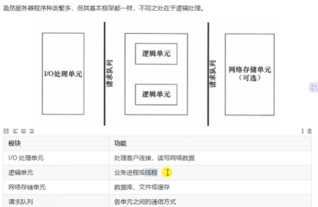

## MySQL数据库的使用

常见的服务器设计，其结构组成一般都是：I/O处理模块、业务逻辑模块、数据模块。

我的另一个项目：chatserver聊天服务器其设计模式也是这样：使用Muduo处理网络I/O，编写业务模块代码、数据代码和业务代码要能够实现分离。



这个项目开发的http服务器支持用户的【登陆】和【注册】业务。为了保存用户的登陆名称和密码，采用MySQL数据库进行落地存储。

### MySQL使用介绍
这部分大家自行学习吧。简单的使用掌握就行，对数据库的增删改查命令要熟悉。书籍这边推荐《MySQL必知必会》，几天就能学会MySQL的基础使用  
看书的同时，还可以配合牛客网的刷题网站，通过刷题加深记忆

### 环境配置
为了让这个项目成功编译，你需要提前配置好mysql的库。
本项目需要安装mysql-server以及对应的开发包。ubuntu环境安装mysql-server和mysql开发包，包括mysql头文件和动态库文件，命令如下：
~~~c
sudo apt-get install mysql-server    =》 安装最新版MySQL服务器
sudo apt-get install libmysqlclient-dev =》 安装开发包
~~~
安装完成后需要设置MySQL的登录用户和密码，按下面步骤修改mysql的root用户密码为123456：
```c
【step 1】tony@tony-virtual-machine:~$ sudo cat /etc/mysql/debian.cnf
[client]
host     = localhost
user     = debian-sys-maint        《==============  初始的用户名
password = Kk3TbShbFNvjvhpM      《=============== 初始的密码
socket   = /var/run/mysqld/mysqld.sock
【step 2】用上面初始的用户名和密码，登录mysql server，修改root用户的密码，命令如下：
tony@tony-virtual-machine:~$ mysql -u debian-sys-maint -pKk3TbShbFNvjvhpM       
  
命令解释： -u后面是上面查看的用户名 -p后面紧跟上面查看的密码
mysql> update mysql.user set authentication_string=password('123456') where 
user='root' and host='localhost';
mysql> update mysql.user set plugin="mysql_native_password";
mysql> flush privileges;
Query OK, 0 rows affected (0.01 sec)
mysql> exit
Bye
```

如果用户名和密码无法修改成功，也可以在CSDN上找到对应的解决方法

为了能够正确运行项目中的代码，还需导入项目要用到的表
导入文件在：[thirdparty/httpserver.sql](../../thirdparty/httpserver.sql)  
导入的方法请自行查询，也是很简单的

### 设计方法
对于网页上用户的登陆和注册业务，从项目业务逻辑上分析的话，这个服务器需要以下的功能支持：
- 支持POST请求。用户名和密码会通过POST请求被传输到服务器上。所以，httpconnect模块要能够解析出POST请求中携带的用户名和密码
- 解析得到的用户名和密码在MySQL数据库中进行查验。账号密码正确，服务器回报登陆成功页面；如果错误也需要告知客户端。登陆和注册业务在服务器端很好区别，通过解析URL地址能够获知客户端是在登陆页面，还是在注册页面发送过来的POST请求

### MySQL的开发方式
与MySQL数据库相关的代码文件总共有三个：
[include/db/database.h](../../include/db/database.h)  
[include/db/user.h](../../include/db/user.h)  
[include/model/usermodel.h](../../include/model/usermodel.h)  

#### database.h
这个头文件的作用是操作数据库的，负责完成对数据库的连接、更新、查询操作。

连接的数据库名称、主机名等信息，我预先定义在了文件起始位置。如果你的数据库设置和我的不一样的话，请按照你的配置进行修改
```c
// 数据库配置信息
static std::string server = "127.0.0.1";
static std::string user = "root";
static std::string password = "123456";
static std::string dbname = "webserver";
````

#### user.h
user类是一个ORM类。ORM全称Object Relational Mapping，即对象关系映射。这个类是将我们数据库中的user表的信息映射到类中。对于数据的操作，我们无需再去编写原生sql，取代代之的是基于面向对象的思想去编写类、对象、调用相应的方法等，ORM会将其转换/映射成原生SQL然后交给database.h中的MYSQL类去执行。

#### usermodel.h
这个类才算是真正在数据库中查询user表的一个类的。

定义了两个方法：
```c
// 在数据库中新增一个用户信息
bool insert(User &usr);
// 在数据库中查找用户信息
User query(std::string &name);
```

insert方法会往user表中插入一个新的用户信息（账号名称和密码）。这个方法是针对注册业务使用的

query方法在user表中查询用户名为name的信息，返回值是一个User对象。如果没有找到用户名，该User对象的成员信息都是空值。


### 实战使用

具体代码使用，请查看：[src/httprequest.cpp:_getPost()](../../src/httprequest.cpp)